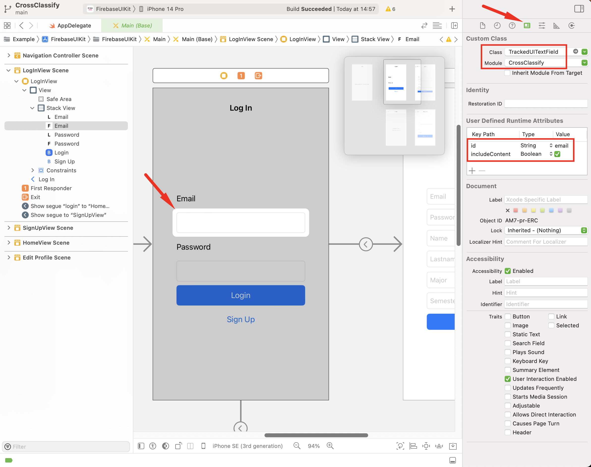
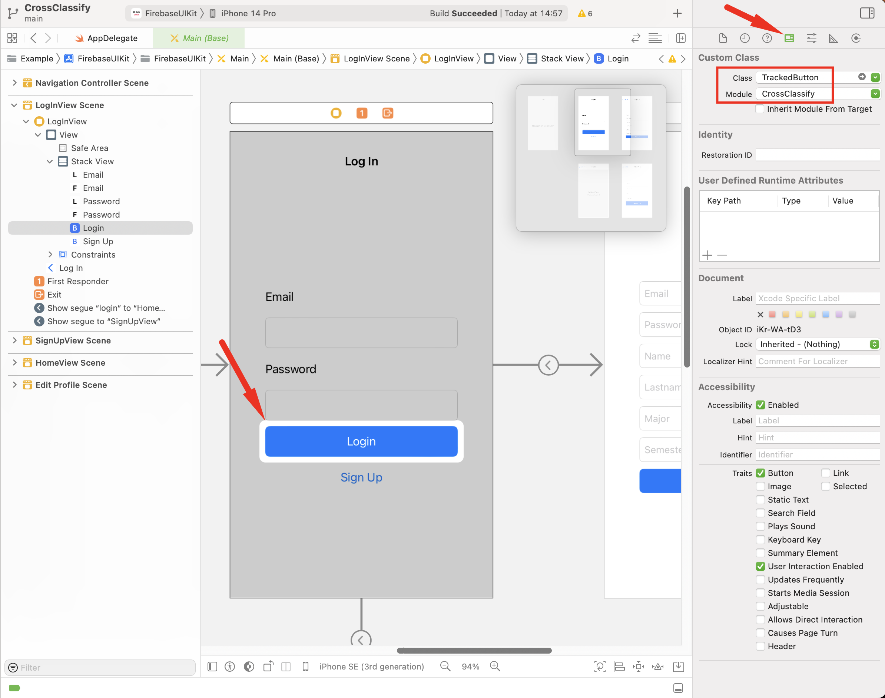

# CrossClassify iOS SDK
The CrossClassify SDK for iOS apps, with two integrated examples:
* [FirebaseSwiftUI](https://github.com/Balaviknesh/iOS-SwiftUI-Firebase-Login-Example): a simple **SwiftUI** app for login/signup using Firebase Authentication integrated with CrossClassify SDK using **CocoaPods**
* [FirebaseUIKit](https://github.com/angelmtzr/ios-firebase-example): a simple **UIKit** app for login/signup using Firebase Authentication integrated with CrossClassify SDK using **Swift Package Manager**

See Section [Setup Example Apps Locally](https://github.com/crossclassify/xc-sdk-ios/#setup-example-apps-locally) to run the complete example apps, or navigate to Section [SDK Integration Guide](https://github.com/crossclassify/xc-sdk-ios/#sdk-integration-guide) to easily integrate CrossClassify SDK with your iOS app.

### **Prerequisites**

-   iOS 13.0 (or later)
-   Xcode 13.3.1 (or later)
-   Swift 5.6 (or later)
-   CocoaPods 1.10.0 (or later) or Swift Package Manager Support
-   SwiftUI or UIKit
-   A [CrossClassify](https://app.crossclassify.com) account
-   A Firebase account (only for example apps)

### **Setup Example Apps locally**
1.  Clone or download the project
2.  Run the terminal on the project folder
3.  ```pod install``` or ```arch -x86_64 pod install```
4.  Open .xcworkspace file
5.  Copy the `GoogleService-Info.plist` (from your Firebase project) file to these paths:
    - ./Example/FirebaseSwiftUI/FirebaseSwiftUI
    - ./Example/FirebaseUIKit/FirebaseUIKit
6.  Change the `siteId` and `apiKey` (from your [CrossClassify](https://app.crossclassify.com) project) in CrossClassify instances placed in:
    - ./Example/FirebaseSwiftUI/FirebaseSwiftUI/CrossClassifyInstance.swift
    - ./Example/FirebaseUIKit/FirebaseUIKit/CrossClassifyInstance.swift
6.  Build and run (FirebaseSwiftUI or FirebaseUIKit target).

## **SDK Integration Guide**

To make it easy for you to get started with CrossClassify SDK, here's the list of the next steps:

1. [Install the CrossClassify SDK](https://github.com/crossclassify/xc-sdk-ios/#step-1-install-the-crossclassify-sdk)
2. [Import the CrossClassify module](https://github.com/crossclassify/xc-sdk-ios/#step-2-import-the-crossclassify-module)
3. [Initialize the CrossClassify object](https://github.com/crossclassify/xc-sdk-ios/#step-3-initialize-the-crossclassify-object)
4. [Track pages without any form](https://github.com/crossclassify/xc-sdk-ios/#step-4-track-pages-without-any-form)
5. [ Track pages containing a form](https://github.com/crossclassify/xc-sdk-ios/#step-5-track-pages-containing-a-form)


### **Step 1:** Install the CrossClassify SDK
-  **CocoaPods**

    1.  Open a terminal window and navigate to the root directory of your project.

    2.  If you don't already have a `Podfile`, create one by running the following command:
    ```pod init``` 

    3.  Open the `Podfile` in a text editor and add the following line:
    ```pod 'CrossClassify'```

    4.  Save the `Podfile` and run the following command to install the CrossClassify SDK:
    ```pod install```

- **Swift Package Manager**


    To integrate via a `Package.swift` manifest instead of Xcode, you can add
    CrossClassify to the dependencies array of your package:

    ```swift
    dependencies: [
    .package(url: "https://github.com/crossclassify/xc-sdk-ios", from: "1.0.1"),
    // Any other dependencies you have...
    ],
    ```

    Then, in any target that depends on the CrossClassify SDK, add it to the `dependencies`
    array of that target:

    ```swift
    .target(
    name: "MyTargetName",
    dependencies: [
        .product(name: "CrossClassify", package: "xc-sdk-ios"),
        // Any other dependencies you have...
    ]
    ),
    ```
    Or add the package by selecting `File` → `Add Packages…` in Xcode’s menu bar.

### **Step 2:** Import the CrossClassify module

In the file where you want to use the CrossClassify SDK, add the following line at the top:
```swift
import CrossClassify
```

### **Step 3:** Initialize the CrossClassify object

Add the following code to your app, replacing "SITE_ID_HERE" and "API_KEY_HERE" with your site ID and API key:
```swift
extension CrossClassify {
    public static let shared: CrossClassify = CrossClassify(siteId: "SITE_ID_HERE", apiKey: "API_KEY_HERE")
}
```
This creates a static constant named `shared` that is an instance of the `CrossClassify` class initialized with your site ID and API key.

### **Step 4:** Track pages without any form 
For each page that contains no form (e.g. home page) do the following instruction. Based on your selected framework, see steps 4.1 and 4.2 for SwiftUI and UIKit versions respectively. In both versions, you must specify **the page name**.

#### **Step 4.1:** `SwiftUI` pages
-   Add the following functions in the `body` variable of the `view` struct, repacing the `"PAGE_NAME_HERE"` with the actual name of the page you want to track:
    ```swift
    .onAppear{CrossClassify.shared.track(pageName: "PAGE_NAME_HERE")} 
    .onDisappear{CrossClassify.shared.stopTrack()}
    ```

#### **Step 4.2:** `UIKit` pages
-   Add the following code in the `viewDidAppear(_:)`, repacing the `"PAGE_NAME_HERE"` with the actual name of the page you want to track:
    ```swift
    CrossClassify.shared.track(pageName: "PAGE_NAME_HERE") 
    ```
-    Add the following code in the `viewDidDisappear(_:)` method: 
        ```swift
        CrossClassify.shared.stopTrack()
        ```

### **Step 5:** Track pages containing a form 
For each page that contains a form (e.g. signup, login) do the following instructions. Based on your selected framework, see steps 5.1 and 5.2 for SwiftUI and UIKit versions respectively. In both versions, you must specify the following information:

* The page name (e.g. `loginPage`, `signupPage`, and `updateProfilePage`)
* The form name (e.g. `login`, `singup`, and `updateProfile`)
* For each field in the form:
    * ID (e.g. `username`, `password`, and `address`)
    * Content tracking status (whether you want to send us the field content)
        > **Note**
        > Sending field contents increases the accuracy of the CrossClassify fraud detection algorithm. Hence, content tracking is HIGHLY RECOMMENDED on all non-confidential fields.
* The submission button
#### **Step 5.1:** `SwiftUI` pages

1. **Specify Page Name and Form Name**

    Call the following functions from the `body` variable of the `view` struct:
    ```swift
    .onAppear{CrossClassify.shared.track(pageName: "PAGE_NAME_HERE", formName: "FORM_NAME_HERE")}
    .onDisappear{CrossClassify.shared.stopTrack()}
    ```
    Replace `"PAGE_NAME_HERE"` and `"FORM_NAME_HERE"` with the actual names of the page and the form you want to track.

2. **Specify Tracked Form Fields**

    For a text field (e.g. email), change the `TextField` struct to `TrackedTextField`. Also, you have to specify the id and content tracking status (`trackContent`):

    ```swift
    TrackedTextField("AS_IS",       // leave this parameter with no change
                     text: $AS_IS), // leave this parameter with no change
                     id: "FIELD_NAME_HERE",
                     trackContent: false,
                     cc: CrossClassify.shared)
    ```
    If the text field doesn't contain private information (e.g. password), change the second function input to `true`. Supported SwiftUI fields in the CrossClassify SDK are `TextField`, `SecureField`, `DatePicker`, ``Picker``, `Toggle`, `Stepper`, and `Slider`. For all field types, simply add the `Tracked` prefix to the field name (e.g. `TrackedStepper`)

3. **Specify the Form Submission Button**

    Add the following code inside the `action` parameter of the button:

    ```swift
    CrossClassify.shared.submit()
    ```
#### **Step 5.2:** `UIKit` pages
1. **Specify Page Name and Form Name**
    -   add the following code in the `viewDidAppear(_:)` method if the page contains a form:
        ```swift
        CrossClassify.shared.track(pageName: "PAGE_NAME_HERE", formName: "FORM_NAME_HERE", view: view)
        ```
        Replace `"PAGE_NAME_HERE" `and `"FORM_NAME_HERE"` with the actual name of the page and the form you want to track.
    - Add the following code in the `viewDidDisappear(_:)` method: 
        ```swift
        CrossClassify.shared.stopTrack()
        ```
    

2.  **Specify Tracked Form Fields**
    - For a text field (e.g. email), change the `UITextField` class to `TrackedUITextField` and its module to `CrossClassify`.

    - In the Attributes Inspector, add a new User Defined Runtime Attribute with Key Path `id` and set its value to the id of the text field (e.g. `password`). Also, if the text field doesn't contain private information (e.g. `username`), add another boolean attribute with Key Path `includeContent`.

    With these steps, you have successfully added a TrackedUITextField to your ViewController and set its formName and id attributes. Repeat this process for any additional fields in your form. Supported UIKit fields in the CrossClassify SDK are `UITextField`, `UIDatePicker`, `UISegmentedControl`, `UIPickerView`, `UISwitch`, and `UISlider`. For all field types, simply add the `Tracked` prefix to the field name (e.g. `TrackedUIDatePicker`)

3.  **Specify the Form Submission Button**

    Change the `UIButton` class to `TrackedUIButton` and its module to `CrossClassify`.


## Requirements of Fraud Detection Sevices

Account Opening Service:

* Valid `SiteId` and `apiKey` (from CrossClassify account)
* In the `track` function, the `formName` must contain the `signup` substring (e.g. `signupFrom`).
* In the email field, the `id` must contain the `email` substring.
* In the email field, the `trackContent` must be `True`.
* In the signup form view, the form submission button must be specified.

Account Takeover Service:

* Valid `SiteId` and `apiKey` (from CrossClassify account)
* In the `track` function, the `formName` must contain the `login` substring (e.g. `loginFrom`).
* In the email field, the `id` must contain the `email` substring.
* In the email field, the `trackContent` must be `True`.
* In the login form view, the form submission button must be specified.


## A Simple SwiftUI Example
In this example, we show the changes made in a simple SwiftUI application, before and after applying the integration steps. The `CrossClassifyInstance.swift` is a new file, and the `LoginView.swift` is an existing file:
### [CrossClassifyInstance.swift](Example/FirebaseSwiftUI/FirebaseSwiftUI/CrossClassifyInstance.swift)

```diff
+   import CrossClassify
+
+   extension CrossClassify {
+       public static let shared = CrossClassify(siteId: "1", apiKey: "GOTOappDOTcrossclassifyDOTcom")
+   }

```

### [SignInView.swift](Example/FirebaseSwiftUI/FirebaseSwiftUI/SignInView.swift)

```diff
    import SwiftUI
+   import CrossClassify

    struct SignInView: View {

        @State var emailAddress: String = ""
        @State var password: String = ""

        var body: some View {
            
            VStack {
-               TextField(
+               TrackedTextField(
                    "user@domain.com", 
                    text: $emailAddress),
+                   id: "email", trackContent: true, cc: CrossClassify.shared
                )
-               SecureField(
+               TrackedSecureField(
                    "Enter a password", 
                    text: $password),
+                   id: "password", cc: CrossClassify.shared
                )

                Button("Sign In", action: {
+                       CrossClassify.shared.submit()
                        ...
                        }
                    )
                ...
            }
+           .onAppear{CrossClassify.shared.track(pageName: "signin", formName: "login")}
+           .onDisappear{CrossClassify.shared.stopTrack()}
        }

    }

```

## A Simple UIKit Example
In this example, we show the changes made in a simple UIKit application, before and after applying the integration steps. The `CrossClassifyInstance.swift` is a new file. Also, `LoginViewController.swift` and `Login.storyboard` are existing files:

### [CrossClassifyInstance.swift](Example/FirebaseUIKit/FirebaseUIKit/CrossClassifyInstance.swift)
```diff
+   import CrossClassify
+
+   extension CrossClassify {
+       public static let shared = CrossClassify(siteId: "1", apiKey: "GOTOappDOTcrossclassifyDOTcom")
+   }

```
### [LoginViewController.swift](Example/FirebaseUIKit/FirebaseUIKit/LoginViewController.swift)

```diff
    import UIKit
+   import CrossClassify

    class LoginViewController: UIViewController {

        override func viewDidAppear(_ animated: Bool) {
            super.viewDidAppear(animated)
+           CrossClassify.shared.track(pageName: "login", formName: "login", view: view)
            ...
        }
        
        override func viewDidDisappear(_ animated: Bool) {
            super.viewDidDisappear(animated)
+           CrossClassify.shared.stopTrack()
            ...
        }
    }
```

### [Main.storyboard](Example/FirebaseUIKit/FirebaseUIKit/Base.lproj/Main.storyboard)

- Email Field:

<p align="center">

</p>

- Button:

<p align="center">

</p>
